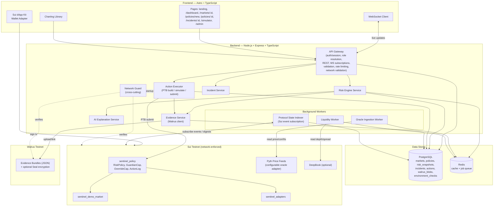
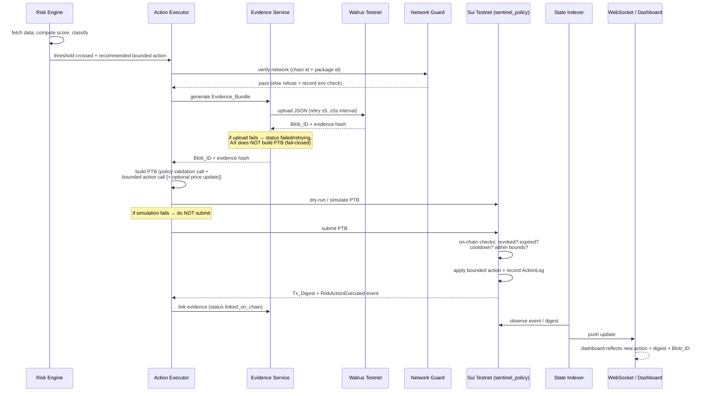
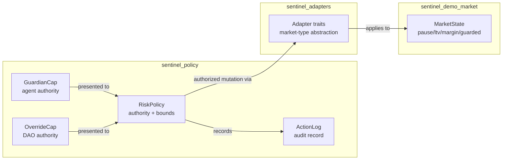
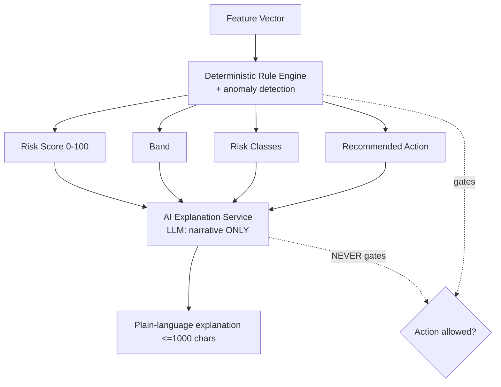
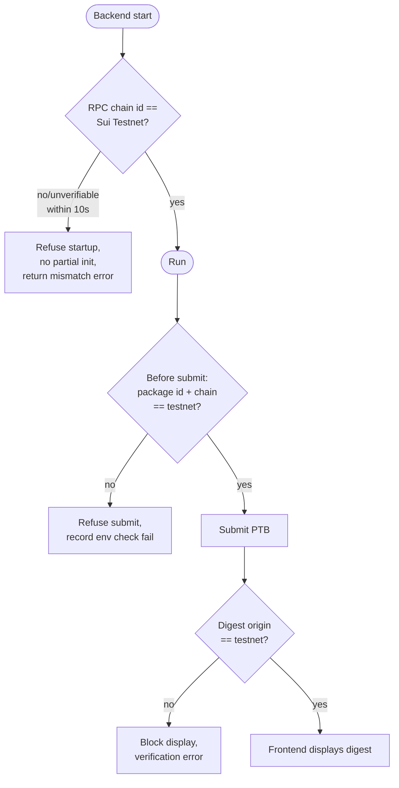
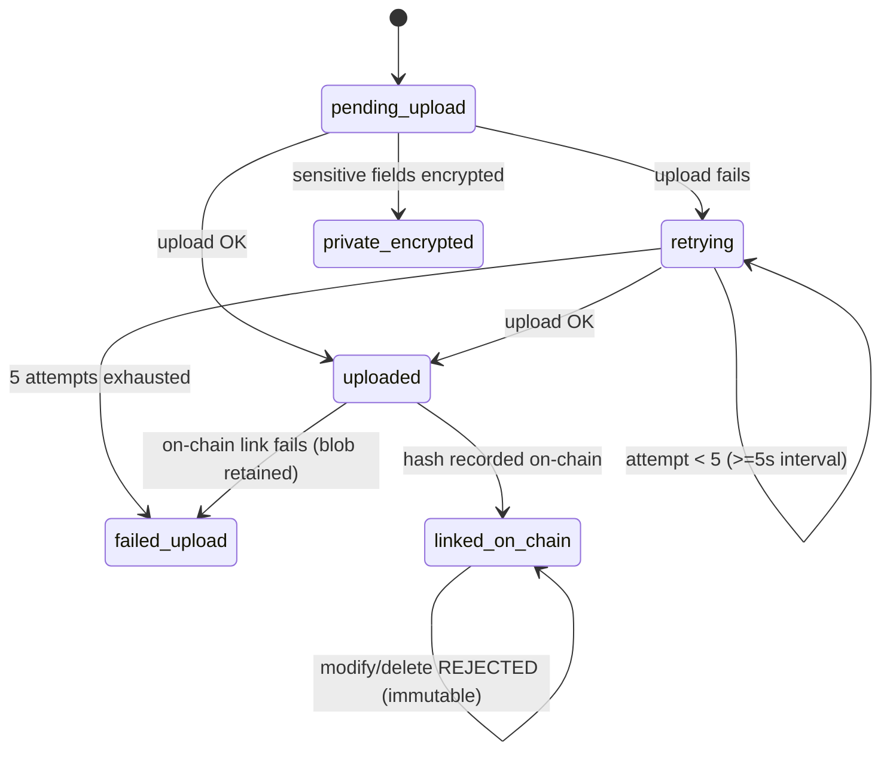

# Design Document: Sentinel Risk Guardian

## Overview

Sentinel is a full-stack risk-control loop for Sui DeFi markets. It continuously ingests market and oracle data, computes an AI-assisted risk score (0–100), and — when risk crosses a configured threshold — autonomously executes a *bounded* on-chain safety action through a Sui Move policy object. The system is built on one non-negotiable principle:

> **The AI never directly controls the protocol. The on-chain `RiskPolicy` object is the sole authority that grants and bounds agent permissions.** The agent holds only a `GuardianCap`; the DAO holds an `OverrideCap`. Every autonomous action passes through on-chain validation (revocation, expiry, cooldown, bounds) before any state change occurs.

The design realizes the thesis: *AI makes risk monitoring faster; Sui makes autonomous AI safer; Walrus makes the AI accountable.*

This document covers the full architecture across four layers:

- **Frontend** — Astro + TypeScript single-page-style dApp (dashboard, onboarding wizard, override console, incident replay, simulation lab) using Sui dApp Kit for wallet connection.
- **Backend** — Node.js + Express + TypeScript API gateway, background workers, and a WebSocket server hosting the Risk Engine, Action Executor, Oracle Ingestion, Liquidity Worker, Protocol State Indexer, Evidence Service, AI Explanation Service, and Incident Service.
- **On-chain** — Three Sui Move packages (`sentinel_policy`, `sentinel_demo_market`, `sentinel_adapters`) deployed to **Sui Testnet only**.
- **Storage / Data** — PostgreSQL (relational config + time-series snapshots), Redis (cache + job queue), and Walrus Testnet (immutable evidence bundles).

Two cross-cutting concerns shape every component:

1. **Network enforcement** — Sui Testnet-only operation is verified at wallet, RPC (chain-identifier), package-ID, and tx-digest-display layers. The backend refuses to start on a network mismatch. *(Requirement 1, 17.1)*
2. **Fail-closed reliability** — Under any uncertainty (missing oracle data, failed simulation, failed evidence upload, stale data, revoked guardian), the system blocks execution rather than acting. *(Requirement 17)*

### Key Design Decisions

| Decision | Rationale | Requirements |
|---|---|---|
| On-chain policy object is the authority, not the agent | Capability-based security; agent authority is verifiable, bounded, and revocable on-chain regardless of backend state | 7, 8, 16, 17.7–17.8 |
| Deterministic rules + anomaly detection for critical thresholds; LLM only for explanation | Critical safety decisions must be reproducible and auditable; LLMs are non-deterministic and cannot be trusted to gate actions | 6.11, 6.13 |
| Evidence uploaded to Walrus *before* building the action PTB | Guarantees every executed action has durable, linkable evidence; supports fail-closed (no evidence → no action) | 9.1, 9.6, 10 |
| Server-defined PTB templates only | Prevents arbitrary/escalating transaction construction from user input | 16.4 |
| Simulate every transaction before submit | Catches policy aborts and bound violations before spending gas or claiming success | 16.5, 17.3 |
| Versioned model/prompt config with admin approval | Reproducibility of evidence; prevents silent model drift | 6.12, 16.10 |

## Architecture

### High-Level System Architecture



### Component Responsibilities

- **API Gateway** — Single ingress for REST and WebSocket. Resolves wallet role (DeFi User, Protocol_Admin via policy ownership, DAO_Governor via OverrideCap holding), validates request bodies, enforces rate limits, and runs network validation on every transaction-bearing request. *(Req 15, 16, 1.6)*
- **Risk Engine Service** — Pulls the latest feature vector from Redis/Postgres, runs deterministic rules + anomaly detection to compute a 0–100 score, assigns a band, classifies risk, and computes the recommended action. Produces the Evidence_Bundle and invokes the AI Explanation Service for the human-readable narrative. *(Req 6)*
- **AI Explanation Service** — Wraps the LLM. Receives the computed score, classes, and feature vector; returns a ≤1000-char plain-language explanation. **Has no authority to change the score or trigger actions.** *(Req 6.5, 6.13)*
- **Action Executor** — Builds PTBs from server-defined templates, simulates them, submits them, and parses the resulting digest/events. Orchestrates the full PTB execution flow. *(Req 7, 9, 16.4, 16.5)*
- **Evidence Service** — Serializes Evidence_Bundles, uploads to Walrus, tracks status lifecycle, retries failed uploads, and enforces immutability of linked evidence. *(Req 10)*
- **Oracle Ingestion Worker** — Polls the configured oracle adapter (Pyth on testnet) for price, confidence, and timestamp; writes snapshots to Redis/Postgres. *(Req 6.1)*
- **Liquidity Worker** — Reads liquidity depth, spread, and imbalance (DeepBook optional, otherwise demo market simulated values). *(Req 6.1)*
- **Protocol State Indexer** — Subscribes to Sui events from `sentinel_policy` and `sentinel_demo_market`, persists ActionLogs/events, and recovers from on-chain transaction digests after restart. *(Req 3.7, 17.6)*
- **Incident Service** — Assembles incident timelines from risk_snapshots, actions, and events for replay. *(Req 13)*
- **Network Guard** — Cross-cutting module invoked at startup (RPC chain-identifier check), before every submission (package ID + chain check), and before every digest display. *(Req 1)*

### Request / Data Flow (steady state)

1. Oracle Ingestion and Liquidity workers write fresh snapshots → Redis (hot) + Postgres (durable time-series).
2. Risk Engine recomputes scores on new data or on a fixed cadence, writes `risk_snapshots`, and pushes updates over WebSocket to subscribed dashboards. *(Req 3.7)*
3. If a score crosses a threshold and a valid GuardianCap authorizes the action, the Action Executor runs the PTB execution flow (below).
4. The Protocol State Indexer observes the emitted event, persists the ActionLog, and the Evidence Service flips the evidence status to `linked_on_chain`.

### PTB Execution Sequence



## Components and Interfaces

### Frontend (Astro + TypeScript)

| Page / Route | Purpose | Key Components | Requirements |
|---|---|---|---|
| `/` (landing) | Project intro, network badge | `NetworkBadge`, `ConnectWalletButton` | 2 |
| `/dashboard` | Risk operations dashboard | `MarketList`, `RiskScoreGauge`, `RiskTrendChart`, `OraclePriceChart`, `IndicatorPanel` (freshness/confidence/volatility/liquidity/exposure), `WhyPanel`, `StaleBadge` | 3 |
| `/markets/:id` | Single market detail | `MarketHeader`, `ParametersCard`, `LastActionCard` (tx digest, blob id, override status), `RiskTrendChart` | 3.3–3.6 |
| `/policies/new` | Onboarding/policy wizard | `WizardStepper`, `MarketTypeStep`, `MarketSelectStep`, `FeedMappingStep`, `ThresholdsBoundsStep`, `DaoAddressStep`, `ReviewStep`, `SignDeployStep` | 4 |
| `/policies/:id` | Policy detail/edit | `PolicyView`, `BoundsView`, `GuardianStatus` | 4, 8 |
| `/incidents/:id` | Incident replay | `IncidentTimeline`, `ScoreMovementChart`, `ActionPointMarker`, `BeforeAfterParams`, `SimulationMarker` | 13 |
| `/simulator` | Simulation lab | `ScenarioPicker` (9 scenarios), `LiveVsSimLabels`, `ScenarioRunner`, `OverrideControls` | 14 |
| `/admin` | Override console + version approval | `OverrideConsole`, `ActiveActionsList`, `ReverseActionPreview`, `RevokeGuardianButton`, `ModelVersionApproval` | 11, 12, 16.10 |

**Wallet adapter contract** — All pages share a `useSuiWallet()` hook exposing `{ address, network, connected, signAndExecute() }`. Signing controls are disabled unless `network === 'sui:testnet'`. *(Req 2.4, 2.5, 1.5)*

### Backend Services and Interfaces

```typescript
// Risk Engine Service
interface RiskEngine {
  evaluate(marketId: string, features: FeatureVector): Promise<RiskEvaluation>;
}
interface RiskEvaluation {
  marketId: string;
  riskScore: number;          // integer 0..100
  band: 'Normal'|'Warning'|'Guarded'|'ParamAdjust'|'EmergencyPause';
  classes: RiskClass[];       // one or more
  recommendedAction: ActionType | null; // null => refuse
  refusalReason?: string;     // set when recommendedAction is null
  confidence: number;         // integer 0..100
  explanation: string;        // <=1000 chars (from AI service)
  ruleOutputs: DeterministicRuleOutput[];
  modelVersion: string;
  promptConfigVersion: string;
  featureVector: FeatureVector;
}

// AI Explanation Service (no authority over score/action)
interface AiExplanationService {
  explain(input: { score: number; band: string; classes: RiskClass[];
                   ruleOutputs: DeterministicRuleOutput[]; }): Promise<string>; // <=1000 chars
}

// Action Executor
interface ActionExecutor {
  buildActionPtb(req: BoundedActionRequest): Ptb;     // server-defined templates only
  simulate(ptb: Ptb): Promise<SimulationResult>;       // dry-run before submit
  submit(ptb: Ptb): Promise<{ txDigest: string; events: SuiEvent[] }>;
  execute(req: BoundedActionRequest): Promise<ActionResult>; // full flow w/ fail-closed gates
}

// Evidence Service
interface EvidenceService {
  generate(evaluation: RiskEvaluation, actionContext: ActionContext): EvidenceBundle;
  upload(bundle: EvidenceBundle): Promise<{ blobId: string; evidenceHash: string }>; // retry <=5, >=5s
  link(blobId: string, actionLogId: string, evidenceHash: string): Promise<void>;     // -> linked_on_chain
  assertMutable(blobId: string): void; // throws if status === linked_on_chain
}

// Network Guard
interface NetworkGuard {
  verifyRpcChainIdAtStartup(): Promise<void>;          // throws -> backend refuses startup
  verifySubmissionTarget(packageId: string): Promise<void>;
  verifyDigestOrigin(txDigest: string): Promise<boolean>;
  recordCheck(type: EnvCheckType, outcome: 'pass'|'fail'): Promise<void>;
}

// Oracle Adapter (configurable; Pyth on testnet)
interface OracleAdapter {
  readFeed(feedId: string): Promise<{ price: bigint; confidence: bigint; timestampMs: number }>;
}
```

### Move Packages and Public Functions

- **`sentinel_policy`** — `create_policy`, `create_guardian_cap`, `create_override_cap`, `revoke_guardian`, `update_thresholds`, `execute_guardian_action`, `pause_market`, `unpause_market`, `adjust_ltv`, `restore_ltv`, `enter_guarded_mode`, `exit_guarded_mode`, `log_action`, `override_action`, `confirm_action`, `reverse_action`. Emits `RiskActionExecuted`, `RiskActionOverridden`, `GuardianRevoked`, `PolicyUpdated`. *(Req 8.5–8.9)*
- **`sentinel_demo_market`** — `init_market`, read-only getters (`get_state`, `get_utilization`, `get_exposure`), policy-controlled mutators (pause/unpause borrows, reduce/restore max LTV, enter/exit guarded mode), `reset_market` (admin-only). *(Req 5)*
- **`sentinel_adapters`** — Adapter traits / market-type abstraction (`lending`, `perps`, `stablecoin`, `demo`) and integration hooks for future real markets. Defines a common interface that `execute_guardian_action` targets, so new market types can be added without changing policy logic. *(Req 4.2, future extensibility)*

## Data Models

### PostgreSQL Schema

```sql
-- markets: monitored market registry
CREATE TABLE markets (
  id              UUID PRIMARY KEY,
  on_chain_id     TEXT NOT NULL,            -- Sui object id of demo market
  market_type     TEXT NOT NULL CHECK (market_type IN ('lending','perps','stablecoin','demo')),
  name            TEXT NOT NULL,
  status          TEXT NOT NULL CHECK (status IN ('Normal','Warning','Guarded','Paused','Revoked')),
  freshness_threshold_ms BIGINT NOT NULL,
  created_at      TIMESTAMPTZ NOT NULL DEFAULT now()
);

-- policies: off-chain mirror of on-chain RiskPolicy config
CREATE TABLE policies (
  id                    UUID PRIMARY KEY,
  market_id             UUID NOT NULL REFERENCES markets(id),
  on_chain_policy_id    TEXT NOT NULL,
  guardian_cap_id       TEXT,
  override_cap_id       TEXT,
  owner_address         TEXT NOT NULL,
  dao_address           TEXT NOT NULL,
  allowed_actions       TEXT[] NOT NULL,
  max_ltv_delta_bps     INTEGER NOT NULL CHECK (max_ltv_delta_bps >= 0),
  max_margin_delta_bps  INTEGER NOT NULL CHECK (max_margin_delta_bps >= 0),
  pause_duration_limit_ms BIGINT NOT NULL CHECK (pause_duration_limit_ms >= 0),
  cooldown_ms           BIGINT NOT NULL CHECK (cooldown_ms >= 0),
  risk_thresholds       JSONB NOT NULL,
  is_revoked            BOOLEAN NOT NULL DEFAULT false,
  is_paused             BOOLEAN NOT NULL DEFAULT false,
  version               INTEGER NOT NULL DEFAULT 1,
  walrus_config_blob_id TEXT,
  created_at            TIMESTAMPTZ NOT NULL DEFAULT now()
);

-- risk_snapshots: time-series of evaluations
CREATE TABLE risk_snapshots (
  id              UUID PRIMARY KEY,
  market_id       UUID NOT NULL REFERENCES markets(id),
  risk_score      INTEGER NOT NULL CHECK (risk_score BETWEEN 0 AND 100),
  band            TEXT NOT NULL,
  classes         TEXT[] NOT NULL,
  confidence      INTEGER NOT NULL CHECK (confidence BETWEEN 0 AND 100),
  feature_vector  JSONB NOT NULL,
  rule_outputs    JSONB NOT NULL,
  recommended_action TEXT,
  refusal_reason  TEXT,
  model_version   TEXT NOT NULL,
  prompt_config_version TEXT NOT NULL,
  explanation     TEXT,                      -- <=1000 chars
  is_simulated    BOOLEAN NOT NULL DEFAULT false,
  data_source     TEXT NOT NULL CHECK (data_source IN ('live','simulated')),
  created_at      TIMESTAMPTZ NOT NULL DEFAULT now()
);

-- incidents: grouped timelines
CREATE TABLE incidents (
  id              UUID PRIMARY KEY,
  market_id       UUID NOT NULL REFERENCES markets(id),
  started_at      TIMESTAMPTZ NOT NULL,
  ended_at        TIMESTAMPTZ,
  scenario_id     TEXT,                      -- set if simulated
  is_simulated    BOOLEAN NOT NULL DEFAULT false,
  summary         TEXT
);

-- actions: executed/reversed actions (mirror of on-chain ActionLog)
CREATE TABLE actions (
  id                  UUID PRIMARY KEY,
  policy_id           UUID NOT NULL REFERENCES policies(id),
  market_id           UUID NOT NULL REFERENCES markets(id),
  incident_id         UUID REFERENCES incidents(id),
  actor               TEXT NOT NULL,
  actor_type          TEXT NOT NULL CHECK (actor_type IN ('agent','dao','admin')),
  risk_score          INTEGER CHECK (risk_score BETWEEN 0 AND 100),
  action_type         TEXT NOT NULL,
  old_value           TEXT,
  new_value           TEXT,
  walrus_evidence_blob_id TEXT,
  evidence_hash       TEXT,
  tx_digest           TEXT,
  is_reversed         BOOLEAN NOT NULL DEFAULT false,
  reversed_by         TEXT,
  reversal_tx_digest  TEXT,
  override_reason     TEXT,
  timestamp_ms        BIGINT NOT NULL,
  created_at          TIMESTAMPTZ NOT NULL DEFAULT now()
);

-- walrus_blobs: evidence lifecycle tracking
CREATE TABLE walrus_blobs (
  blob_id         TEXT PRIMARY KEY,
  action_id       UUID REFERENCES actions(id),
  market_id       UUID REFERENCES markets(id),
  status          TEXT NOT NULL CHECK (status IN
                    ('pending_upload','uploaded','linked_on_chain',
                     'failed_upload','retrying','private_encrypted')),
  evidence_hash   TEXT,
  attempt_count   INTEGER NOT NULL DEFAULT 0 CHECK (attempt_count <= 5),
  last_attempt_at TIMESTAMPTZ,
  payload         JSONB,                     -- retained for reprocessing if not yet linked
  created_at      TIMESTAMPTZ NOT NULL DEFAULT now()
);

-- environment_checks: network enforcement audit trail
CREATE TABLE environment_checks (
  id              UUID PRIMARY KEY,
  check_type      TEXT NOT NULL CHECK (check_type IN
                    ('rpc_chain_id','submission_target','digest_origin','wallet_network')),
  outcome         TEXT NOT NULL CHECK (outcome IN ('pass','fail')),
  detail          TEXT,
  checked_at      TIMESTAMPTZ NOT NULL DEFAULT now()   -- ISO 8601 UTC
);
```

### Move Object Structs

```move
// sentinel_policy
public struct RiskPolicy has key {
    id: UID,
    market_id: ID,
    market_type: u8,
    owner: address,
    dao_override_cap_id: ID,
    guardian_cap_id: ID,
    allowed_actions: vector<u8>,
    max_ltv_delta_bps: u64,
    max_margin_delta_bps: u64,
    pause_duration_limit_ms: u64,
    risk_thresholds: vector<u64>,
    cooldown_ms: u64,
    last_action_timestamp_ms: u64,
    is_revoked: bool,
    is_paused: bool,
    version: u64,
    walrus_config_blob_id: vector<u8>,
    created_at_ms: u64,
}

public struct GuardianCap has key, store {
    id: UID,
    policy_id: ID,
    agent_address: address,
    expires_at_ms: u64,
    allowed_markets: vector<ID>,
    allowed_actions: vector<u8>,
    revoked: bool,
}

public struct OverrideCap has key, store {
    id: UID,
    policy_id: ID,
    dao_address: address,
    can_reverse_action: bool,
    can_revoke_agent: bool,
    can_update_thresholds: bool,
    can_unpause_market: bool,
}

public struct ActionLog has key, store {
    id: UID,
    policy_id: ID,
    market_id: ID,
    actor: address,
    actor_type: u8,
    risk_score: u8,
    action_type: u8,
    old_value: u64,
    new_value: u64,
    walrus_evidence_blob_id: vector<u8>,
    evidence_hash: vector<u8>,
    tx_digest: vector<u8>,
    timestamp_ms: u64,
    reversed_by: Option<address>,
    reversal_tx_digest: vector<u8>,
    is_reversed: bool,
}
```

### Move Events

```move
public struct RiskActionExecuted has copy, drop {
    policy_id: ID, market_id: ID, action_type: u8, risk_score: u8,
    old_value: u64, new_value: u64, evidence_blob_id: vector<u8>,
    evidence_hash: vector<u8>, timestamp_ms: u64,
}
public struct RiskActionOverridden has copy, drop {
    policy_id: ID, original_action_id: ID, dao_address: address,
    reason: vector<u8>, timestamp_ms: u64,
}
public struct GuardianRevoked has copy, drop {
    policy_id: ID, guardian_cap_id: ID, dao_address: address, timestamp_ms: u64,
}
public struct PolicyUpdated has copy, drop {
    policy_id: ID, version: u64, timestamp_ms: u64,
}
```

### Evidence_Bundle JSON Schema

```json
{
  "schemaVersion": "1.0",
  "marketId": "string",
  "policyId": "string",
  "timestampMs": 0,
  "dataSource": "live | simulated",
  "scenarioId": "string | null",
  "prices": { "price": "string", "confidence": "string", "oracleTimestampMs": 0, "freshnessMs": 0 },
  "liquidity": { "depth": "string", "spread": "string", "imbalance": "string" },
  "exposureSnapshot": { "utilization": "string", "exposure": "string" },
  "riskModelVersion": "string",
  "promptConfigVersion": "string",
  "featureVector": { "...": "numeric features" },
  "riskScore": 0,
  "riskClasses": ["..."],
  "recommendedAction": "string | null",
  "executedAction": "string | null",
  "aiExplanation": "string (<=1000 chars)",
  "deterministicRuleOutputs": [{ "rule": "string", "fired": true, "value": "string" }],
  "agentSigner": "string",
  "txDigest": "string | null",
  "priorActionIds": ["..."],
  "rawDataHash": "string",
  "sensitiveFieldsEncrypted": ["...optional field names if private_encrypted..."]
}
```

The bundle MUST exclude secrets and private keys for any non-private status (Req 10.8). Fields designated sensitive by policy config are encrypted (optionally via Seal) before storage and the bundle status becomes `private_encrypted` (Req 10.9).

## On-Chain Architecture

### Package Responsibilities



- **`sentinel_policy`** is the trust root. It owns the bounds (`max_ltv_delta_bps`, `max_margin_delta_bps`, `pause_duration_limit_ms`, `cooldown_ms`), the revocation/expiry state, and the validation logic. No state change to a guarded market is possible without presenting a capability to this package.
- **`sentinel_demo_market`** holds mutable market state but only exposes mutators that require proof of policy authorization (a hot-potato/witness pattern passed from `execute_guardian_action`). Admin-only `reset_market` is gated by the stored `owner`/admin address. *(Req 5.3, 5.4, 5.6)*
- **`sentinel_adapters`** abstracts the market type so the policy package targets a uniform interface, enabling future real-market integrations without touching enforcement logic.

### Capability Model

- **GuardianCap (agent)** — Bounded authority: only `allowed_markets`, only `allowed_actions`, only until `expires_at_ms`, only while `revoked == false`, only after `cooldown_ms` elapsed. Held by the server-side agent signer. *(Req 8.2, 8.10)*
- **OverrideCap (DAO)** — Privileged authority flags: `can_reverse_action`, `can_revoke_agent`, `can_update_thresholds`, `can_unpause_market`. Required for `override_action`, `reverse_action`, `revoke_guardian`, `update_thresholds`, `unpause_market`. *(Req 8.3, 8.13)*
- The agent can **never** transfer funds, change the admin, remove the OverrideCap, or update the RiskPolicy itself — these paths abort unconditionally. *(Req 7.7, 16.7)*

### `execute_guardian_action` Enforcement (the critical path)

Before applying any change, the function verifies, in order, aborting on the first failure with no state mutation (Req 8.10–8.12, 8.14):

1. `cap.revoked == false`  *(else abort — Req 7.8, 12.3)*
2. `cap.expires_at_ms > tx_timestamp_ms`  *(else abort — Req 7.8)*
3. `target_market ∈ cap.allowed_markets`  *(else abort — Req 7.3)*
4. `action_type ∈ cap.allowed_actions`  *(else abort — Req 7.4)*
5. `tx_timestamp_ms - policy.last_action_timestamp_ms >= policy.cooldown_ms`  *(else abort — Req 7.8)*
6. action delta within bounds: `ltv_delta <= max_ltv_delta_bps`, `margin_delta <= max_margin_delta_bps`, `pause_duration <= pause_duration_limit_ms`  *(else abort — Req 7.5, 7.6, 7.9, 8.12)*

On success: apply the bounded mutation via the adapter, set `last_action_timestamp_ms = tx_timestamp_ms`, create an `ActionLog`, and emit `RiskActionExecuted`. *(Req 8.14, 9.4)*

### PTB Composition (server-defined templates only)

A single PTB binds data, evidence, and enforcement into one atomic transaction (Req 9.2, 9.3, 16.4):

1. *(optional)* `pyth::update_price_feed(price_update_data)` — when the feed requires refresh.
2. `sentinel_policy::execute_guardian_action(policy, guardian_cap, market, action_type, params, evidence_blob_id, evidence_hash, clock)` — performs validation **and** the bounded action atomically; aborts revert the entire PTB.

Because validation and action share one transaction, a failed policy check rolls back the action (Req 9.7), and a successful action is always accompanied by a recorded ActionLog and event (Req 9.4).

## API Design

### REST Endpoints

**Read endpoints** *(Req 15.1)*:

| Method | Path | Description |
|---|---|---|
| GET | `/api/markets` | List monitored markets with status |
| GET | `/api/markets/:id` | Market detail (params, last action, digest, blob id, override status) |
| GET | `/api/markets/:id/risk` | Current risk score, band, indicators, freshness |
| GET | `/api/incidents/:id` | Incident timeline for replay |
| GET | `/api/actions/:id` | Single action record |

**Action endpoints** *(Req 15.2)*:

| Method | Path | Description | Notes |
|---|---|---|---|
| POST | `/api/policies/draft` | Validate + draft a policy config | Range-validates all bounds (Req 4.9) |
| POST | `/api/policies/simulate` | Dry-run policy deployment PTB | |
| POST | `/api/actions/recommend` | Run risk engine, return recommendation | May return refusal + reason (Req 6.7–6.10) |
| POST | `/api/actions/execute` | Run full PTB execution flow | Network + simulation gated (Req 16.5, 17) |
| POST | `/api/evidence/upload` | Upload an Evidence_Bundle to Walrus | Retry lifecycle (Req 10.6) |
| POST | `/api/simulator/start` | Start a named scenario | One of 9 (Req 14.1) |
| POST | `/api/simulator/reset` | Reset demo market + scenario | (Req 14.5) |

All endpoints validate input and return descriptive errors on bad input (Req 15.4) and enforce a configurable rate limit, rejecting excess requests (Req 15.5).

### WebSocket Message Types

```typescript
type ServerMessage =
  | { type: 'risk_update'; marketId: string; snapshot: RiskSnapshot }
  | { type: 'action_executed'; marketId: string; action: ActionRecord }   // includes txDigest, blobId
  | { type: 'guardian_revoked'; marketId: string; at: string }            // dashboard -> Revoked <=5s (Req 12.2)
  | { type: 'override_applied'; marketId: string; action: ActionRecord }
  | { type: 'stale_data'; marketId: string }                              // (Req 3.9, 17.5)
  | { type: 'env_check_failed'; checkType: string; detail: string };

type ClientMessage =
  | { type: 'subscribe'; marketId: string }
  | { type: 'unsubscribe'; marketId: string };
```

## Risk Scoring Model

### Feature Groups and Weighting

The Risk_Score is a weighted aggregate of five feature groups (weights from the PRD), each normalized to a 0–100 subscore (Req 6.2):

| Feature Group | Weight | Inputs |
|---|---|---|
| Oracle risk | 25% | freshness/staleness, confidence interval, divergence |
| Volatility | 25% | 1m/5m/15m price changes, realized volatility |
| Liquidity | 20% | depth, spread, imbalance |
| Protocol exposure | 20% | utilization, exposure, current max LTV |
| Governance / config | 10% | policy state, prior overrides, guardian revocation state |

`Risk_Score = round( Σ (weight_i × subscore_i) )`, clamped to `[0, 100]`. The weights sum to 1.0, guaranteeing the output range. *(Req 6.2, invariant — see Correctness Properties)*

### Score Bands

```
0–39   Normal
40–59  Warning
60–74  Guarded recommended
75–89  parameter adjustment recommended
90–100 emergency pause recommended
```

Exactly one band is assigned for any score (the bands partition `[0,100]`). *(Req 6.3)*

### Deterministic Rules vs LLM Split



- **Deterministic rules + anomaly detection** compute the score, band, classes, and recommended action. These are reproducible and are the *only* inputs that gate actions. *(Req 6.11, 6.13)*
- **The LLM** produces the human-readable explanation only and can never change the score or trigger an action. *(Req 6.13)*
- **Refusal rules (fail-closed)** — the engine refuses to recommend an action and records a reason when: oracle price/confidence/timestamp is absent or unparseable (6.7), network is not Sui Testnet (6.8), the GuardianCap is revoked (6.9), or the recommended action would exceed policy bounds (6.10).
- **Stale-data emergency** — if oracle timestamp age exceeds the freshness threshold and policy permits, recommend an emergency pause with a recorded stale-data justification. *(Req 6.14)*
- Each evaluation records `model_version`, `prompt_config_version`, and the `feature_vector`. *(Req 6.12)*

### Action Priority

When multiple actions are recommended for one market, the executor runs the highest-priority first; **pause-new-borrows is priority zero**, followed by reduce max LTV, enter guarded mode, increase maintenance margin. *(Req 7.1, 7.2, 7.10)*

## Network Enforcement & Security Design

### Network Enforcement (Sui Testnet only)



- **Startup** — verify configured RPC chain identifier matches the known Sui Testnet id; if mismatched or unverifiable within 10s, refuse startup with no partial initialization. *(Req 1.3, 1.4)*
- **Wallet** — frontend blocks signing and shows the testnet-switch message if the wallet reports a non-testnet network. *(Req 1.5, 2.4)*
- **Submission** — verify target package ID + RPC chain before every submission; refuse and record an environment check failure on mismatch. *(Req 1.6, 1.7)*
- **Display** — verify a tx digest originates from testnet before the frontend shows it; block display + return a verification error otherwise. *(Req 1.8, 1.9)*
- Every verification result is recorded in `environment_checks` with an ISO 8601 UTC timestamp, type, and pass/fail outcome. *(Req 1.10)*

### Security Controls (defense in depth)

| Control | Implementation | Requirements |
|---|---|---|
| Agent keys server-side only | Keys live in backend env vars; never sent to frontend | 16.1, 16.3 |
| Least privilege | Agent signer limited to approved actions; on-chain GuardianCap further bounds it | 16.2 |
| Server-defined PTB templates | Action Executor builds PTBs from fixed templates; arbitrary PTB input rejected | 16.4 |
| Simulate before submit | Dry-run every PTB; abort on simulation failure | 16.5, 17.3 |
| On-chain authority root | Policy package is authoritative even if backend is down | 17.7, 17.8 |
| No privilege escalation | Agent cannot remove OverrideCap, change admin, or edit policy | 7.7, 16.7 |
| Versioned model/prompt + admin approval | New model/prompt version requires admin approval before use | 16.10 |
| Auditable events | Every action/reversal/revocation emits an on-chain event | 16.8 |

## Error Handling

The system is **fail-closed**: under any uncertainty or failure it blocks execution rather than acting (Req 17). Errors are handled per subsystem as follows.

### Fail-Closed Gates (Action path)

| Failure | Behavior | Requirements |
|---|---|---|
| Wallet not on Sui Testnet | Action Executor blocks execution | 17.1 |
| Risk evaluation incomplete/failed | No action executed | 17.2 |
| Missing/unparseable oracle data | Risk Engine refuses recommendation + records reason | 6.7 |
| Network not testnet (engine) | Refuse recommendation + record reason | 6.8 |
| GuardianCap revoked | Refuse recommendation; on-chain also rejects | 6.9, 7.8, 12.3 |
| Recommended action exceeds bounds | Refuse recommendation; on-chain also aborts | 6.10, 8.12 |
| Transaction simulation fails | Do not submit | 16.5, 17.3 |
| Policy validation in PTB fails | Surface failed tx; record no successful action | 9.7 |

### Evidence Retry Strategy



- Upload failures retry up to 5 attempts, ≥5s apart; if exhausted, status becomes `failed_upload`, the unuploaded bundle is preserved for reprocessing, and an error is returned. *(Req 10.6, 10.7, 17.4)*
- If evidence upload fails, the Action Executor does **not** build or submit the action PTB and marks evidence pending for retry. *(Req 9.6)*
- If on-chain hash linking fails, the stored Blob_ID is retained, status set to `failed_upload`, and an error returned. *(Req 10.5)*
- Any attempt to modify/delete `linked_on_chain` evidence is rejected; the stored bundle and recorded hash are left unchanged. *(Req 10.10)*

### Transaction Simulation / Failure

- Every PTB is dry-run before submission; a failed simulation aborts the flow with no submission. *(Req 16.5, 17.3)*
- A failed on-chain transaction is surfaced to the frontend for display; no successful action is recorded. *(Req 16.6, 7.5, 7.6, 9.7)*

### Event Indexer Recovery

- On restart after an outage, the Protocol State Indexer recovers event indexing from on-chain transaction digests (replaying from the last persisted checkpoint), reconciling the database with chain state. *(Req 17.6)*
- While the backend is unavailable, the policy package remains the authoritative source of policy and market state; a revoked GuardianCap fails autonomous actions on-chain regardless of backend state. *(Req 17.7, 17.8)*

### Input Validation & Rate Limiting

- All requests are validated; invalid input is rejected with a descriptive error. *(Req 15.4)*
- Requests above the configured rate limit are rejected. *(Req 15.5)*
- The onboarding wizard blocks submission and identifies any missing or out-of-range value before signing. *(Req 4.9)*

## Correctness Properties

*A property is a characteristic or behavior that should hold true across all valid executions of a system — essentially, a formal statement about what the system should do. Properties serve as the bridge between human-readable specifications and machine-verifiable correctness guarantees.*

The following properties were derived from the acceptance-criteria prework and consolidated to remove redundancy. Each is universally quantified and suitable for property-based testing.

### Property 1: Risk score is always within range

*For any* feature vector (including extreme, missing-defaulted, and adversarial values), the Risk_Engine SHALL produce a risk score that is an integer in `[0, 100]` and a confidence in `[0, 100]`.

**Validates: Requirements 6.2, 6.5, 3.3, 14.2**

### Property 2: Band assignment partitions the score range

*For any* risk score in `[0, 100]`, the engine SHALL assign exactly one band according to the mapping (0–39 Normal, 40–59 Warning, 60–74 Guarded, 75–89 ParamAdjust, 90–100 EmergencyPause) — no score maps to zero or multiple bands.

**Validates: Requirements 6.3**

### Property 3: Risk classification is a non-empty subset of the allowed set

*For any* completed evaluation, the produced risk classes SHALL be a non-empty subset of {flash crash, oracle staleness, oracle divergence, stablecoin depeg, liquidity collapse, liquidation cascade, high utilization, governance override, guardian revocation, data integrity}.

**Validates: Requirements 6.4**

### Property 4: Explanation never gates decisions (deterministic independence)

*For any* feature vector, the computed score, band, classes, and recommended action SHALL be identical regardless of the AI Explanation Service output; and the explanation length SHALL be at most 1000 characters.

**Validates: Requirements 6.5, 6.11, 6.13**

### Property 5: Fail-closed — no action recommended under uncertainty

*For any* evaluation where oracle price, confidence, or timestamp is absent/unparseable, OR the active network is not Sui Testnet, OR the GuardianCap is revoked, OR the recommended action would exceed policy bounds, the Risk_Engine SHALL produce no recommended action (null) and SHALL record a refusal reason.

**Validates: Requirements 6.7, 6.8, 6.9, 6.10, 17.1, 17.2**

### Property 6: Stale-data emergency recommendation

*For any* market where the oracle timestamp age exceeds the configured freshness threshold and the policy permits an emergency stale-data pause, the engine SHALL recommend an emergency pause and record a stale-data justification.

**Validates: Requirements 6.14**

### Property 7: Evidence-before-PTB ordering

*For any* action whose evaluation crosses a threshold, the Evidence_Bundle SHALL be uploaded (yielding a Blob_ID + hash) before the action PTB is built; and if the upload fails, no action PTB SHALL be built or submitted and the evidence SHALL be marked pending/retrying.

**Validates: Requirements 9.1, 9.2, 9.6**

### Property 8: On-chain bound enforcement

*For any* `execute_guardian_action` whose LTV delta exceeds `max_ltv_delta_bps`, OR margin delta exceeds `max_margin_delta_bps`, OR pause duration exceeds `pause_duration_limit_ms`, the policy package SHALL abort the transaction and apply no market state change.

**Validates: Requirements 7.5, 7.6, 7.9, 8.12**

### Property 9: On-chain capability-state rejection

*For any* `execute_guardian_action` where the GuardianCap is revoked, expired (`expires_at_ms <= tx_timestamp`), or within cooldown (`tx_timestamp - last_action_timestamp_ms < cooldown_ms`), OR the network is not Sui Testnet, the policy package SHALL abort and apply no market state change — regardless of backend state.

**Validates: Requirements 7.8, 8.10, 8.11, 12.3, 17.8**

### Property 10: On-chain scope enforcement

*For any* `execute_guardian_action` whose target market is not in `allowed_markets` or whose action type is not in `allowed_actions`, the policy package SHALL abort and apply no state change.

**Validates: Requirements 7.3, 7.4**

### Property 11: Forbidden agent operations always rejected

*For any* attempt by the agent to transfer funds, change the admin, remove the OverrideCap, or update the RiskPolicy itself, the policy package SHALL abort and apply no state change.

**Validates: Requirements 7.7, 16.7**

### Property 12: Successful action records and emits atomically

*For any* successful `execute_guardian_action`, the policy package SHALL set `last_action_timestamp_ms` to the transaction timestamp, record an ActionLog containing the Blob_ID, evidence hash, and Tx_Digest, and emit a `RiskActionExecuted` event — all within the same transaction.

**Validates: Requirements 8.14, 9.4, 16.8**

### Property 13: Override operations require a valid OverrideCap

*For any* call to `override_action`, `reverse_action`, `revoke_guardian`, `update_thresholds`, or `unpause_market` without a valid OverrideCap for the target RiskPolicy (or with the relevant capability flag false), the policy package SHALL abort and leave state unchanged.

**Validates: Requirements 8.13, 12.5**

### Property 14: Guardian revocation is atomic and idempotent

*For any* valid `revoke_guardian` call, the GuardianCap `revoked` state SHALL become true and a `GuardianRevoked` event SHALL be emitted in the same transaction; and *for any* GuardianCap already revoked, a repeat revocation SHALL leave `revoked` true and SHALL NOT emit a duplicate event.

**Validates: Requirements 12.1, 12.6**

### Property 15: Action priority ordering

*For any* non-empty set of recommended actions for a single market, the Action_Engine SHALL select the highest-priority action first, with pause-new-borrows as priority zero.

**Validates: Requirements 7.10, 7.1, 7.2**

### Property 16: Demo market reset round-trip and admin gating

*For any* sequence of authorized state mutations on a Demo_Market, an admin-invoked reset SHALL restore the market to its initialized values; and *for any* reset invoked by a non-admin actor, the call SHALL be rejected with state unchanged.

**Validates: Requirements 5.5, 5.6**

### Property 17: Demo market authorization gating

*For any* state-changing call to the Demo_Market that is not authorized by the RiskPolicy or the admin, the market SHALL reject the call and apply no state change.

**Validates: Requirements 5.3, 5.4**

### Property 18: Evidence bundle completeness

*For any* generated Evidence_Bundle, the serialized JSON SHALL contain all required fields (market/policy identifiers, timestamp, prices, oracle confidence/freshness, liquidity/exposure snapshots, model versions, feature vector, score, classes, recommended/executed action, explanation, deterministic rule outputs, agent signer, transaction digest, prior action ids, scenario id, raw data hash).

**Validates: Requirements 10.1**

### Property 19: Evidence has exactly one valid status

*For any* Evidence_Bundle at any point in its lifecycle, its status SHALL be exactly one of {pending_upload, uploaded, linked_on_chain, failed_upload, retrying, private_encrypted}.

**Validates: Requirements 10.3**

### Property 20: Linked evidence is immutable

*For any* Evidence_Bundle whose status is `linked_on_chain`, any request to modify or delete it SHALL be rejected, leaving the stored bundle and recorded evidence hash unchanged.

**Validates: Requirements 10.10**

### Property 21: Upload retry is bounded

*For any* failing evidence upload, the Evidence_Vault SHALL make at most 5 attempts with at least 5 seconds between attempts; and after the 5th failed attempt the status SHALL be `failed_upload` with the unuploaded bundle preserved for reprocessing.

**Validates: Requirements 10.6, 10.7, 17.4**

### Property 22: Secrets are never present in non-private evidence

*For any* Evidence_Bundle whose status is `uploaded`, `linked_on_chain`, or `pending_upload`, the serialized content SHALL contain no secrets or private keys; and *for any* field designated sensitive by policy config, that field SHALL be encrypted and the status SHALL be `private_encrypted`.

**Validates: Requirements 10.8, 10.9, 16.1**

### Property 23: Simulated data is never labeled as live

*For any* data element displayed in the Simulation_Lab, the element SHALL carry exactly one label from {live oracle data, simulated scenario data, real testnet transaction, Walrus evidence}, and simulated data SHALL never be labeled as live oracle data.

**Validates: Requirements 14.6, 14.7**

### Property 24: Network verification is always recorded

*For any* network verification performed (RPC chain id, submission target, digest origin, wallet network), an `environment_checks` record SHALL be created with an ISO 8601 UTC timestamp, the verification type, and a pass/fail outcome; and any failed submission-target or digest-origin verification SHALL block the corresponding action/display.

**Validates: Requirements 1.6, 1.7, 1.8, 1.9, 1.10**

### Property 25: Backend refuses startup on network mismatch

*For any* configured RPC chain identifier that does not equal the Sui Testnet chain identifier (or that cannot be verified within 10 seconds), the Network_Guard SHALL prevent backend startup with no partial initialization and return a network-mismatch/unverifiable error.

**Validates: Requirements 1.3, 1.4**

### Property 26: Wizard rejects invalid configuration

*For any* policy configuration with a missing required value or a value outside its allowed range, the frontend SHALL block submission and identify the invalid value.

**Validates: Requirements 4.9**

### Property 27: Server-defined PTB templates only

*For any* action request, the Action_Executor SHALL construct the PTB from a server-defined template and SHALL reject any attempt to supply arbitrary PTB structure from user input.

**Validates: Requirements 16.4**

### Property 28: Simulate-before-submit

*For any* action execution, transaction simulation SHALL precede submission, and if simulation fails the transaction SHALL NOT be submitted.

**Validates: Requirements 16.5, 17.3**

### Property 29: Indexer reconciles to chain state after restart

*For any* set of actions recorded on-chain, after a backend restart the Protocol State Indexer SHALL recover from the on-chain transaction digests such that the persisted action records match the on-chain ActionLog set.

**Validates: Requirements 17.6**

### Property 30: Invalid API input is rejected; rate limit enforced

*For any* request with invalid input the backend SHALL reject it with a descriptive error; and *for any* request stream exceeding the configured rate limit, the excess requests SHALL be rejected.

**Validates: Requirements 15.4, 15.5**

### Property 31: Model/prompt version requires approval before use

*For any* risk model or prompt configuration version that has not received admin approval, the backend SHALL block its use until approval is granted.

**Validates: Requirements 16.10**

### Property 32: Override reason is required and recorded in evidence

*For any* override operation, the Override_Console SHALL require an override reason and that reason SHALL appear in the resulting evidence and ActionLog.

**Validates: Requirements 11.6, 11.4**

## Testing Strategy

Sentinel uses a layered strategy. Property-based testing applies strongly to the risk-scoring math, policy bound enforcement, and evidence-lifecycle invariants. Example-based, integration, and snapshot tests cover UI rendering, route wiring, and external-service behavior where PBT does not add value.

### Move Unit Tests (permission boundaries)

The `sentinel_policy` package MUST include Move unit tests verifying permission boundaries (Req 16.9), covering Properties 8–14:

- Bounds: LTV/margin/pause-duration over cap aborts with no state change (Property 8).
- Capability state: revoked / expired / within-cooldown / non-testnet aborts (Property 9).
- Scope: market/action not allowed aborts (Property 10).
- Forbidden ops: transfer funds, change admin, remove OverrideCap, edit policy all abort (Property 11).
- Success path: `last_action_timestamp_ms` updated, ActionLog recorded, event emitted (Property 12).
- Override authority: override/reverse/revoke/update/unpause require valid OverrideCap (Property 13).
- Revocation atomicity + idempotence; no duplicate `GuardianRevoked` (Property 14).
- Demo market reset round-trip and admin gating (Properties 16, 17).

Move tests use the test scenario framework with a mocked `Clock` to exercise expiry and cooldown boundaries deterministically.

### Property-Based Tests (backend / engine)

PBT is appropriate here because the risk engine and policy-bound logic are pure functions over large input spaces with clear invariants.

- **Library**: `fast-check` for the TypeScript backend; Sui Move's native `#[test]` framework for on-chain properties (proptest-style generation emulated via parameterized test vectors and the Move test scenario for the bound/state-machine properties).
- **Do NOT implement PBT from scratch.**
- **Minimum 100 iterations** per property test.
- **Tag format** on each property test: `// Feature: sentinel-risk-guardian, Property {number}: {property_text}`.
- Each correctness property maps to a **single** property-based test.

Generators:
- `FeatureVector` arbitrary covering full numeric ranges, missing/unparseable oracle fields, and extreme values (Properties 1–6).
- `PolicyConfig` + `ActionRequest` arbitraries spanning in-bounds and out-of-bounds deltas (Properties 8, 26).
- `CapabilityState` arbitrary across revoked/expired/cooldown/active and network values (Properties 5, 9).
- `EvidenceBundle` arbitrary across all statuses and sensitive-field configurations (Properties 18–22).
- `ActionSet` arbitrary for priority ordering (Property 15).

### Backend Unit / Integration Tests

- **Unit (example-based)**: wallet display states (Req 2), incident timeline assembly, "Why?" panel content, specific refusal-reason strings.
- **Integration**: Walrus upload round-trip within 30s (Req 10.2 — INTEGRATION, 1–2 examples), oracle adapter read against testnet (1–2 examples), WebSocket push delivery, indexer recovery against a seeded chain checkpoint (Property 29 verified with a small fixed action set), end-to-end `POST /api/actions/execute` happy path and fail-closed paths.
- **Smoke**: all REST routes exist and respond (Req 15.1, 15.2); exactly nine simulator scenarios are registered (Req 14.1); backend refuses startup on a deliberately wrong RPC chain id (Property 25 boundary check); secrets sourced from env vars only (Req 16.3).

### Frontend Tests

- **Component / snapshot tests** for dashboard, wizard, override console, incident replay, and simulation-lab labeling (Property 23 verified via rendering assertions that no element is dual-labeled and simulated is never `live`).
- **Interaction tests**: wallet connect/disconnect and wrong-network gating disable signing controls (Req 2.4, 2.5, 1.5); wizard validation blocks submission and identifies invalid fields (Property 26).
- Network badge and stale-data badge rendering (Req 3.1, 3.9).

### End-to-End Demo Rehearsal

A scripted rehearsal exercises the judge-facing flow on Sui Testnet: deploy policy via wizard → run a simulation-lab scenario (e.g., SUI flash crash) → observe autonomous pause-new-borrows PTB → verify on-chain ActionLog + `RiskActionExecuted` event + Walrus Blob_ID + tx digest on the dashboard → perform a DAO reverse → revoke the guardian and confirm a subsequent action is rejected on-chain (Property 9/14). This validates the integrated fail-closed and capability-enforcement behavior end to end, including network verification at each transaction (Property 24).

### Coverage Mapping Summary

| Layer | Properties / Criteria |
|---|---|
| Move unit tests | Properties 8–14, 16, 17; Req 16.9 |
| Backend PBT (fast-check) | Properties 1–7, 15, 18–24, 26–32 |
| Backend integration | Req 10.2, 14.2 timing, Property 29 |
| Smoke | Req 14.1, 15.1, 15.2, 16.3; Property 25 |
| Frontend component/interaction | Req 2, 3, 4, 11, 13; Properties 23, 26 |
| E2E rehearsal | Integrated 1, 7, 9, 10, 12, 14 |
